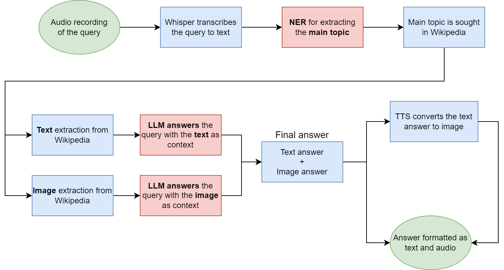
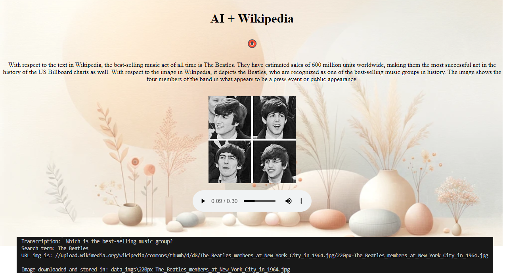

# Flask app that combines OpenAI services with Wikipedia for additional context.
## Especially useful for people with visual impairements.

Talk to the app and it will search on Wikipedia for the topic related to your comment or question. 
After that, if a question was made it tries to answer it, otherwise it summarizes the text on Wikipedia and describes the main image.

The answer is returned in both text and audio in order to show how it can be applied to the real world, by helping people with visual impairements.

### **How the app works**:

The flow of the app is the following:
- An audio is recorded with the red button.
- When the audio recording is stopped, Whisper converts the audio to text.
- The audio is stored, in the folder *recordings*. A timestamp differentiates the audios.
- The LLM (GPT in this case) uses its Named Entity Recognition (NER) ability to identify the main topic of the audio (person, place, building, company...).
- The entity is sought in Wikipedia.
- The first result in Wikipedia has its text and main image extracted for further processing.
- The image is downloaded in the folder *data_imgs*. Images are not overwritten.
- If there is a question, the LLM tries to answer it using both the text and the image, independently. Else it summarizes the text and describes the picture.
- The answer is converted to audio through OpenAI's TTS service and it is saved in the folder *tts_audios*. A timestamp differentiates the audios.
- The answer as both text and audio as well as the Wikipedia's image are returned to the app for the user to access all three of them.

### **Structure**:

The repository consists of the following files and folders:
- *data_imgs* folder with the downloaded images from Wikipedia.
- *examples* folder with screenshots of queries/interactions. Serves as a preview.
- *recordings* folder containing the voice recordings.
- *requirements* folder for installing the necessary packages and libraries. Can be installed via pip with the *txt* or via conda with *yml*.
- *static* folder with images loaded into the UI for improving its visual appeal.
- *templates* folder with the *html* of the web page.
- *tts_audios* containing the TTS result. This is the audio response of the LLM after accessing the text and image from Wikipedia.
- *flask_wiki_app.py* where the processing of audios, images and texts happens.

### **Usage**: 

 - A *.env* file must exist at the root of the directory and it must have the appropriate values (OPENAI_API_KEY="sk-XXXX...") for the correct functioning of the app.
 - Use the *requirements.txt* or *environment.yml* file in the *requirements* folder for installing the Python packages.
 - From the root of the directory, run the file *flask_wiki_app.py*. In the terminal the URL where the app is running should appear. Specifically it should be a line that looks like this one: *Running on http://127.0.0.1:5000*. Enter that URL to see the UI.

#### **Note**:
 - **The OpenAI API is used, which requires and OpenAI account and calling it has associated costs.**
 - **The Python version is 3.11.0.**
 - **Conda 24.1.2 was used for the generation of the environment and the development of the app.**
 - **This work is part of my Master's Thesis.**

--- 

Screenshot of the user interface + backlog from the terminal:

